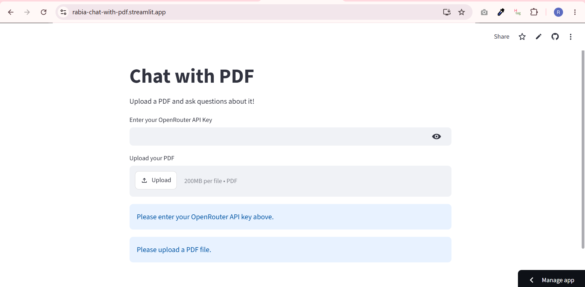
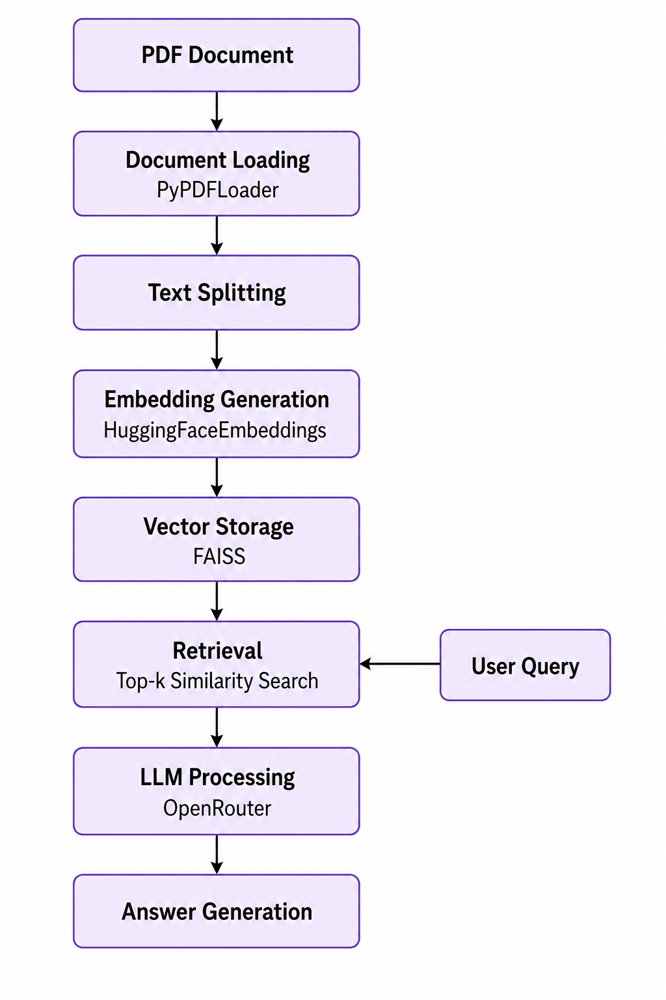

# Chat with PDF — RAG System

Chat with any PDF document using natural language. 
Built with LangChain, HuggingFace embeddings, and FAISS.

## Demo

[🔗 Live Demo](https://rabia-chat-with-pdf.streamlit.app/)

## The Problem
Reading long PDFs and finding specific information 
is slow and painful. This app lets you just ask 
questions in plain English and get instant answers.

## How It Works
1. Upload any PDF
2. Document splits into chunks automatically
3. HuggingFace creates semantic embeddings
4. FAISS indexes them for fast similarity search
5. Your question retrieves the most relevant chunks
6. LLM generates a grounded answer from those chunks

## Tech Stackgit add .
- LangChain — orchestration
- HuggingFace sentence-transformers — embeddings
- FAISS — vector similarity search
- OpenRouter — free LLM API access
- Streamlit — frontend

## What I Learned
- How RAG differs from pure LLM generation
- Why chunking strategy matters for answer quality
- How vector similarity search works under the hood

## Run Locally
git clone [repo]
pip install -r requirements.txt
# Add OPENROUTER_API_KEY to .env
streamlit run app.py